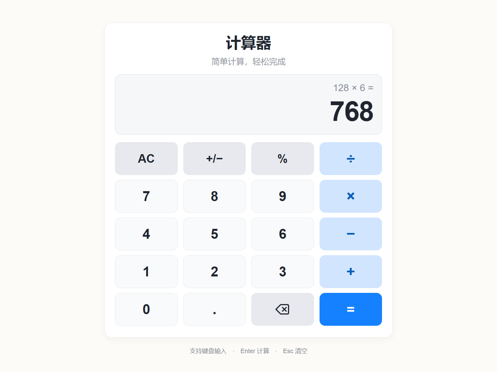

# 网页计算器

基于原生 HTML、CSS 和 JavaScript 的离线计算器，支持鼠标和键盘操作，并适配桌面与手机屏幕。

基础版本已完成。详细进度与验证记录见 [PROJECT_STATUS.md](PROJECT_STATUS.md)，设计说明见 [DESIGN.md](DESIGN.md)。

## 快速开始

双击当前文件夹中的 [index.html](index.html)，使用浏览器打开即可，**无需安装、联网或启动服务**。

请将 `index.html`、`styles.css`、`calculator.js` 和 `app.js` 保持在同一个文件夹。日常使用不需要 Node.js；运行测试时才需要。

## 功能

- 加减乘除、小数、正负切换、百分比。
- 清空、退格、连续运算与重复等号。
- 除零及结果溢出提示，输入数字后恢复计算。
- 键盘输入、按钮焦点提示及按下反馈。
- 浅色卡片、四列五行按键及响应式布局。

## 键盘操作

| 按键 | 操作 |
| --- | --- |
| `0–9`、`.` | 输入数字、小数点 |
| `+`、`-`、`*`、`/` | 加、减、乘、除 |
| `%` | 当前数字除以 100 |
| Enter 或 `=` | 计算结果 |
| Esc 或 Delete | 清空 |
| Backspace | 删除正在输入的最后一位 |
| Tab | 切换按钮焦点 |
| 空格 | 按下当前聚焦的按钮 |

正负切换可点击 `+/−` 按钮。

## 运算规则

- 连续运算按输入顺序逐步执行，例如 `2 + 3 × 4 = 20`。
- `%` 将当前数字除以 100，例如输入 `50` 后按 `%`，得到 `0.5`。
- 再按等号重复上次运算，例如 `2 + 3 = =` 得到 `8`。
- 得到结果后，输入数字开始新计算；输入运算符继续计算。
- 输入最多 12 位数字，结果最多保留 12 位有效数字，必要时使用科学计数法。
- 使用 JavaScript 数值运算与结果格式化；当前不支持任意精度、括号、科学计算或历史记录。

## 界面预览

[原始 UI 效果图](calculator-ui-preview.png) · [桌面实际截图](calculator-desktop.png) · [手机尺寸截图](calculator-mobile.png)



## 项目文件

| 文件 | 用途 |
| --- | --- |
| [index.html](index.html) | 页面入口与按键结构 |
| [styles.css](styles.css) | 样式、交互反馈与响应式布局 |
| [calculator.js](calculator.js) | 计算逻辑与状态管理 |
| [app.js](app.js) | 显示更新、鼠标及键盘事件 |
| [calculator.test.cjs](calculator.test.cjs) | 核心运算检查 |
| [browser-qa.cjs](browser-qa.cjs) | 本机 Chrome 浏览器验证脚本 |
| [calculator-ui-preview.png](calculator-ui-preview.png) | 原始 UI 效果图 |
| [calculator-desktop.png](calculator-desktop.png) | 桌面实际截图，1448 × 1086 |
| [calculator-mobile.png](calculator-mobile.png) | 手机尺寸实际截图，390 × 844 |
| [DESIGN.md](DESIGN.md) | 设计、实施及视觉验证记录 |
| [PROJECT_STATUS.md](PROJECT_STATUS.md) | 当前状态、验证结果与交接信息 |

## 测试与验证

在项目文件夹中运行以下命令。已验证的 Node.js 版本为 `v24.21.0`，测试无需安装第三方包。

核心检查：

```powershell
node --test --test-isolation=none calculator.test.cjs
```

浏览器检查及截图更新：

```powershell
node browser-qa.cjs
```

浏览器脚本使用本机 Chrome 的无界面模式及 DevTools 协议，默认程序路径为 `C:/Program Files/Google/Chrome/Application/chrome.exe`。若安装位置不同，请修改脚本中的路径。脚本会创建 `.browser-qa` 临时配置目录，并更新两张实际截图。

最近一次实现阶段验证结果（2026-09-14）：

- 23 项核心检查通过，0 项失败。
- Chrome 页面加载、20 个按键、鼠标乘法、键盘小数运算、退格及除零恢复检查通过。
- 已检查 1448 × 1086 桌面视口和 390 × 844 手机模拟视口；手机横向溢出及长数字显示检查通过。
- 测试期间未捕获 JavaScript 异常或 `console.error`。

其他浏览器和手机真机尚未验证。本次 README 更新仅修改文档，未重新运行上述测试。

## Git 状态

截至 2026-09-14 最近一次检查，当前文件夹尚未初始化为 Git 仓库，执行 `git status` 返回 `fatal: not a git repository`。文件已保存在本地；本次文档更新未初始化仓库或创建提交。
